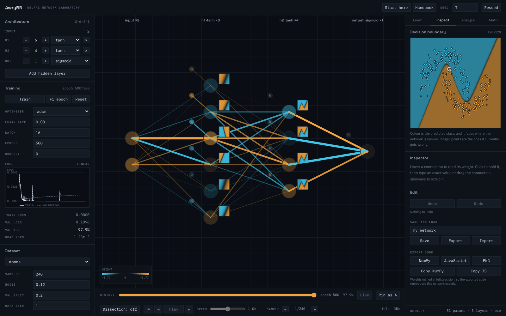
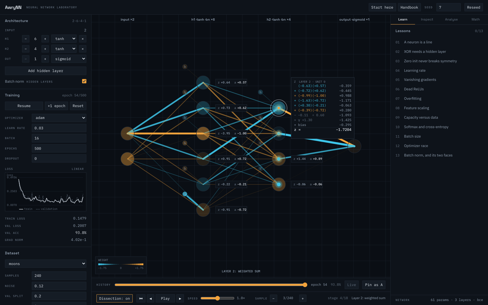
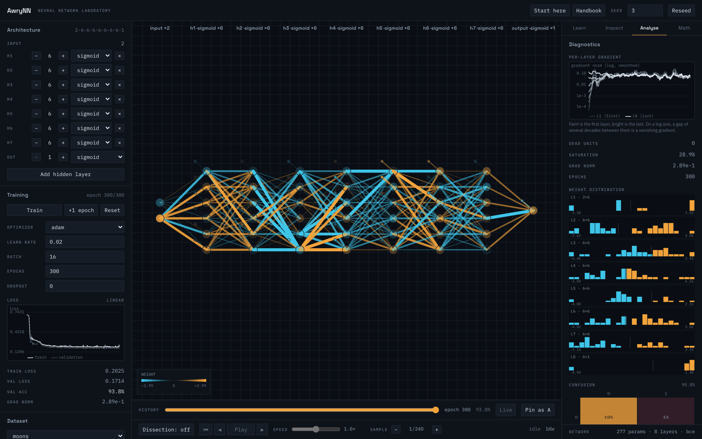
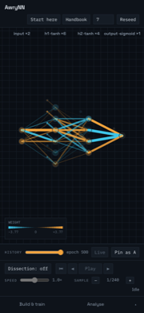

# AwryNN

**A neural network you can watch think.**

A real feedforward network, implemented from scratch in TypeScript, rendered on a
canvas you can pause, step through, take apart and break on purpose. No ML
library. No backend. No network requests at runtime.

The forward pass, backpropagation, six optimizers, batch normalization and the
regularization are plain arithmetic over `Float64Array`, and **every number the
interface shows is a number the engine actually computed.**



> **New here?** Read [**Using AwryNN**](docs/USING.md) next. It is the practical
> companion to this file: what to do in your first ten minutes, a lesson-by-lesson
> path, and the exercises that make the ideas stick.

---

## Run it

You need [Node.js](https://nodejs.org) 20.19+ or 22.12+. Nothing else.

```bash
git clone https://github.com/<you>/AwryNN.git
cd AwryNN
npm install
npm run dev
```

Open the address it prints, usually `http://localhost:5173`. That is the whole
setup. There is no database, no API key, no account, and no configuration file to
edit.

To build a static site you can host anywhere:

```bash
npm run build     # writes dist/
npm run preview   # serves it locally to check
```

`dist/` is a plain folder of files with relative paths, so it works from a domain
root or a subdirectory alike. GitHub Pages, Netlify, S3 and a USB stick all
behave the same way.

| Command | What it does |
| --- | --- |
| `npm run dev` | Development server with hot reload |
| `npm run build` | Typecheck (app **and** engine in isolation), then build |
| `npm run preview` | Serve the built site |
| `npm test` | The full suite, 687 tests |
| `npm run gradcheck` | The gradient-check matrix, the correctness gate |
| `npm run headless` | Train XOR, moons, spiral and glyphs with no browser |
| `npm run lint` | ESLint |
| `npm run docs:lessons` | Regenerate `docs/LESSONS.md` from the lesson data |

---

## What you can learn from it

Most explanations of neural networks give you either the equations or an
animation. This gives you both at once, wired to each other, so you can check one
against the other.

### The mechanics, made concrete

**Watch a single number travel.** Turn on **Dissection** and press
<kbd>Space</kbd>. One sample walks through the network while the arithmetic
assembles beside each neuron, one term per arriving pulse, with a running
subtotal that ticks:

```
Z  LAYER 2 · UNIT 0
   (+0.73)(−0.12)     −0.085
 + (+0.65)(−0.16)     −0.106
 + (−0.52)(+0.42)     −0.216
 + (−0.65)(+0.04)     −0.029
 + (−0.60)(−0.07)     +0.044
 + (−0.10)(+0.12)     −0.012
 + bias               +0.000
z =                   −0.4043
```

Add the right-hand column up yourself. Then the loss card, then the backward pass
right to left, showing `∂L/∂w = δ·a` and `Δw = −η·∂L/∂w` with real numbers before
each connection visibly re-weights.



**Feel what a weight does.** Drag any connection sideways and the decision
boundary moves under your hand, live. Type an exact value if you prefer. Freeze a
layer, ablate a neuron, randomize one column, and watch the rest of the network
cope or fail.

**Build XOR by hand.** The classic "one layer cannot do this" problem, with a
checker that tells you when your hand-placed weights actually solve it.

### The failures, on purpose

Thirteen lessons, each a preset with a stored seed, a success condition evaluated
against live metrics, and an explanation you can read whenever you like rather
than only after succeeding.

| | Lesson | What breaks, and why |
| --- | --- | --- |
| 1 | A neuron is a line | One neuron draws exactly one straight boundary |
| 2 | XOR needs a hidden layer | And stacked linear layers never help, however wide |
| 3 | Zero init never breaks symmetry | Every hidden unit stays the same unit forever |
| 4 | Learning rate | Too small crawls, too large destroys |
| 5 | Vanishing gradients | Eight sigmoid layers, four decades of gradient lost |
| 6 | Dead ReLUs | Units that switch off permanently and never return |
| 7 | Overfitting | Memorising instead of generalising, watched live |
| 8 | Feature scaling | One input times a hundred, and training falls apart |
| 9 | Capacity versus data | Underfit, fit and memorise, on the same spiral |
| 10 | Softmax and cross-entropy | Probabilities that always sum to one |
| 11 | Batch size | Batch 1, 8 and full batch, read from the loss curve |
| 12 | Optimizer race | Four optimizers, identical seed, identical start |
| 13 | Batch norm, and its two faces | The same sample gets two different answers |

Full text in [`docs/LESSONS.md`](docs/LESSONS.md).



### Leave with something that runs

Export the trained network as **NumPy** or **dependency-free JavaScript**, with
every weight inlined at full float64 precision. The generated code reproduces the
engine's own output exactly, and that equivalence is asserted by the test suite
over a hundred random inputs per architecture.

---

## Why you might trust the numbers

"Every number is real" is easy to claim and hard to earn, so it is checked rather
than asserted.

**Analytic gradients are verified against numerical ones.** The suite runs
`{linear, relu, leaky_relu, tanh, sigmoid} × {mse, bce, cce} × {with, without L2}
× {2-1, 2-4-1, 2-8-6-3}`, skipping invalid combinations: 60 configurations, 2,379
parameters. Worst relative error **1.09e-9** against a 1e-7 threshold.

Getting there needed Richardson extrapolation rather than a plain central
difference. Truncation error falls as `h²` while roundoff grows as `1/h`, so the
best step depends on `|L|/|g|` and no constant is right everywhere. Details in
[`docs/MATH.md`](docs/MATH.md).

**The dissection view is checked against the engine's own caches.** Every formula
card reads `W`, `b`, `Z`, `A` and `dW` out of the engine after a real forward and
backward pass. The one value computed for display is the per-term product `w·a`,
so each neuron carries a *residual*: the terms as shown, minus the `z` the engine
cached. Worst residual across the full matrix is under 1e-9.

**Determinism is bitwise.** Same seed, same config, same steps produces
byte-identical parameters, asserted over 100 steps by comparing raw bytes.

**Every lesson is trained before it ships.** All thirteen are run headlessly from
their stored seeds and asserted to still demonstrate what they claim.

There is a **Check gradients** button in the app. It runs the same verification on
whatever network you have built, and reports the worst coordinate it found.

---

## Hand it to someone

**Inspect → Share → Copy link.** The URL carries the architecture, the dataset,
every hyperparameter and the weights. There is no backend, so the link *is* the
storage.

It travels in the fragment, after the `#`, which browsers strip before sending a
request. Nothing about your network reaches a server.

A link to an untrained network contains no weights at all, because it does not
need to: initialization is seeded and bitwise deterministic, so the seed
regenerates them. The encoder verifies that rather than assuming it, building a
fresh network and comparing byte for byte, and includes the weights the moment a
single bit differs. When they are included they are float64 and exact. Shipping
float32 to halve the URL would mean the network you opened was not the network
that was sent.

What a link deliberately does not carry is the loss curve. Open a trained network
and the boundary is carved but the chart is empty at epoch 0. Drawing a plausible
curve nobody measured is exactly the fabrication this project exists to avoid, so
the app says what happened instead.

---

## On a phone, and without a mouse



The canvas stays and the panels collapse into a bottom sheet. Pinch to zoom, drag
to pan, tap to select.

The canvas is also fully keyboard navigable: arrows move between columns and
units, <kbd>Shift</kbd> with the arrows walks the connections arriving at a unit,
and every move is announced to a screen reader with the value read from the
engine.

---

## What is in the box

**Ten datasets**, all generated procedurally from a seed:

| Kind | Datasets |
| --- | --- |
| 2-D classification | `xor`, `blobs`, `circles`, `moons`, `spiral`, `checkerboard` |
| 1-D regression | `sine`, `cubic`, `step` |
| Image-like | `glyphs`: 7×5 bitmaps, 35 inputs, up to 14 classes |

**Six activations** (`linear`, `relu`, `leaky_relu`, `tanh`, `sigmoid`,
`softmax`), **three losses** (`mse`, `bce`, `cce`), **seven initializers** and
**six optimizers** (SGD, Momentum, Nesterov, RMSProp, Adam, AdamW), plus L2,
dropout, gradient clipping, batch normalization, early stopping and
standardization, all exposed in the interface.

Four learning-rate schedules (constant, step, exponential, cosine, each with
optional warmup) are implemented and tested in the engine but not yet given a
control in the interface; they are reachable from code.

---

## Layout

```
src/engine/    pure TS over Float64Array. No DOM, no React, no store.
src/worker/    training and decision-boundary workers
src/render/    canvas: layout, scene, draw calls, hit-testing, animation
src/state/     Zustand store, the seam between React and the canvas
src/ui/        React panels around the canvas
src/lessons/   the thirteen lessons, as data
```

Dependencies point downward only. `src/engine/` is the bottom and imports nothing
from the layers above it, enforced three ways: a TypeScript project that compiles
it with no `DOM` lib and no ambient types, a test that scans the source tree, and
ESLint rules. That isolation is what makes the math testable, and it is the
property most likely to be eroded by one convenient import.

---

## Documentation

| | |
| --- | --- |
| [**Using AwryNN**](docs/USING.md) | **Start here.** How to actually get value out of it |
| [Start here](public/guide/start-here.html) | The app explained from zero, in the browser |
| [Handbook](public/guide/handbook.html) | Conventions, controls, and how to verify the engine |
| [`docs/MATH.md`](docs/MATH.md) | Every equation, mapped to the function implementing it |
| [`docs/LESSONS.md`](docs/LESSONS.md) | All thirteen lessons, generated from the lesson data |
| [`docs/ARCHITECTURE.md`](docs/ARCHITECTURE.md) | Data flow, threading, parameter storage |
| [`docs/DESIGN.md`](docs/DESIGN.md) | The token system, and the measurements behind the palette |

The two guides also open from inside the app, top right.

---

## Licence

MIT, plus one condition: nothing built with this may be used to cause harm,
distress or fear to a cat. Use it for anything else you like, commercially or
otherwise. See [`LICENSE`](LICENSE), which defines its terms, including which
grievances a cat is not entitled to file.

The bundled fonts (Space Grotesk, IBM Plex Sans, IBM Plex Mono) are covered
separately by SIL OFL 1.1; see [`public/fonts/OFL.txt`](public/fonts/OFL.txt).
